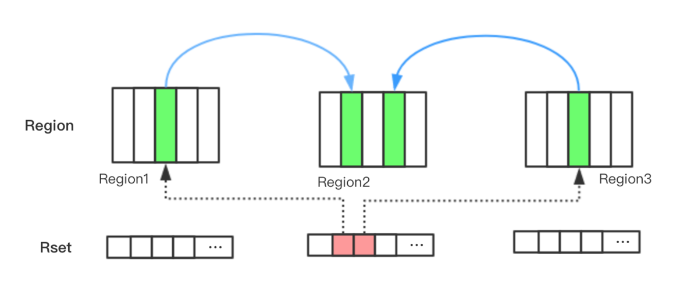
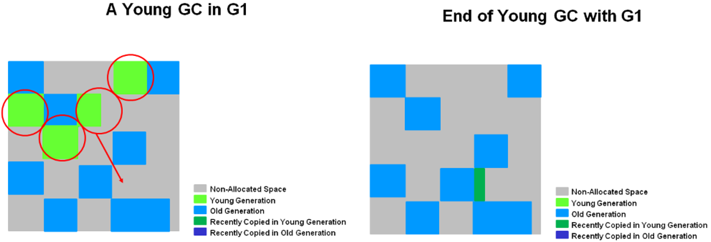

## 一、集合

### 1.ArrayList与LinkendList区别

|                          | ArrayList | LinkendList |
| ------------------------ | --------- | ----------- |
| 数据结构                 | 数组      | 双向链表    |
| 插入和删除受元素位置影响 | &radic;   | &times;     |
| 支持快速随机访问         | &radic;   | &times;     |
| 内存空间连续             | &radic;   | &times;     |

>  补充：RandomAccess是标记接口，如Collections.binarySearch方法会判断传入的list是否实现RandomAccess判断其是否支持快速随机访问，调用不同的方法遍历(索引/迭代器)

list遍历方式选择：

1. 实现了 RandomAccess 接口的list，优先选择普通 for 循环，其次 foreach
2. 未实现 RandomAccess接口的list，优先选择iterator遍历（foreach遍历底层也是通过iterator实现的），大size的数据，千万不要使用普通for循环

### 2.HashMap与HashTable区别

|                     | HashMap                   | HashTable |
| ------------------- | ------------------------- | --------- |
| 线程安全且效率低    | &times;                   | &radic;   |
| 数据结构            | 数组+链表+红黑树（大于8） | 数组+链表 |
| 容量始终为2的幂次方 | &radic;                   | &times;   |
| 初始容量和扩容量    | 16，2n                    | 11，2n+1  |
| 支持Null Key        | &radic;                   | &times;   |

> 

---------------------


## 二、线程

### 1.图解进程与线程的关系


### 2.线程死锁

产生线程死锁的四个必备条件及如何避免：

1. 互斥条件（无法破坏）
2. 请求与保持条件：进程因请求资源而阻塞时，对已获资源保持不放（一次申请完资源）
3. 不剥夺条件:线程已获资源在末使用完之前不能被其他线程强行剥夺（主动释放资源）
4. 循环等待条件（有序申请资源）

### 3.双重校验锁实现对象单例

```java
public class Singleton {

    private volatile static Singleton uniqueInstance;

    private Singleton() {
    }

    public static Singleton getUniqueInstance() {
       //第一次判断防止实例化后还进入判断，提升效率
        if (uniqueInstance == null) {
            //类对象加锁
            synchronized (Singleton.class) {
                if (uniqueInstance == null) {
                    uniqueInstance = new Singleton();
                }
            }
        }
        return uniqueInstance;
    }
}
```

uniqueInstance 采用 volatile 关键字修饰很有必要， uniqueInstance = new Singleton()分为三步执行：

1. 为 uniqueInstance 分配内存空间
2. 初始化 uniqueInstance
3. 将 uniqueInstance 指向分配的内存地址

多线程下JVM的重排序会导致出现问题，如线程T1执行了1和3，T2会返回未被初始化的对象，**volatile可以禁止JVM的重排序**。

### 4.synchronized关键字


### 5.volatile关键字

volatile作用：

1. 可见性（从主存读取，修改后刷新到主存）
2. 防止指令重排序

volatile关键字和synchronized关键字比较：

|                  | volatile         | synchronized   |
| ---------------- | ---------------- | -------------- |
| 线程同步实现级别 | 轻量级、性能更好 | 重量级         |
| 修饰             | 变量             | 方法、代码块   |
| 作用             | 可见性           | 可见性、原子性 |
| 是否阻塞         | &times;          | &radic;        |

### 6.ThreadLocal

实现每个线程都有自己的专属本地变量（线程局部变量）

原理：

每个线程都维护有一个ThreadLocal.ThreadLocalMap，存储以ThreadLocal为key的键值对

```java
public class ThreadLocalExample1 {
    public static void main(String[] args) {
        ThreadLocal threadLocal1 = new ThreadLocal();
        ThreadLocal threadLocal2 = new ThreadLocal();
        Thread thread1 = new Thread(() -> {
            threadLocal1.set(1);
            threadLocal2.set(1);
        });
        Thread thread2 = new Thread(() -> {
            threadLocal1.set(2);
            threadLocal2.set(2);
        });
        thread1.start();
        thread2.start();
    }
}
```


内存泄漏问题：

ThreadLocalMap中的key为ThreadLocal的弱引用，而value是强引用，ThreadLocal在没有被外部强引用的情况，GC时key会被回收，value不会，ThreadLocalMap产生key为null的键值对，会造成内存泄漏，调用set()、get()、remove()的时候会清理掉key为null的记录，使用完手动调用remove()方法可避免内存泄漏

应用场景：

- 每个线程需要有自己单独的实例
- 实例需要在多个方法中共享，但不希望被多线程共享

1）存储用户session

```java
private static final ThreadLocal threadSession = new ThreadLocal();

public static Session getSession() throws InfrastructureException {
    Session s = (Session) threadSession.get();
    try {
        if (s == null) {
            s = getSessionFactory().openSession();
            threadSession.set(s);
        }
    } catch (HibernateException ex) {
        throw new InfrastructureException(ex);
    }
    return s;
}
```

2）解决线程安全问题

```java
public class DateUtil {
    private static ThreadLocal<SimpleDateFormat> format1 = new ThreadLocal<SimpleDateFormat>() {
        @Override
        protected SimpleDateFormat initialValue() {
            return new SimpleDateFormat("yyyy-MM-dd HH:mm:ss");
        }
    };

    public static String formatDate(Date date) {
        return format1.get().format(date);
    }
}
```

原本非线程安全的`SimpleDateFormat`，这里是线程安全的

### 7.线程池

Executor框架结构：

1. 任务（Runnable/Callable）
2. 任务的执行（Executor）
3. 异步计算的结果（Future）

使用示意图：


- **Callable接口用于处理Runnable接口不支持的用例，有返回结果和异常抛出**
- **submit方法相比execut方法**
  - **会返回实现了Future接口的对象，Runnable对象的返回结果为null**
  - **方便异常处理**
- **主线程可以执行 `FutureTask.get()`方法来等待任务执行完成。主线程也可以执行 `FutureTask.cancel（boolean mayInterruptIfRunning）`来取消此任务的执行**

ThreadPoolExecutor执行流程图：


`ThreadPoolExecutor`3个核心参数：

1. **`corePoolSize` :** 最小可以同时运行的线程数量。

2. **`maximumPoolSize` :** 队列存满的时候，当前可以同时运行的线程数量。

3. **`workQueue`:** 当前运行的线程数达到`corePoolSize` ，新任务会进入队列。

`ThreadPoolExecutor`其他常见参数:

1. **`keepAliveTime`**:当线程数量大于 `corePoolSize` 时，多余的空闲线程的最大存活时间 。
2. **`unit`** : 时间单位。
3. **`threadFactory`** :executor 创建新线程的时候会用到。
4. **`handler`** :饱和策略。

Executors的常见线程池对比：

|                      | corePoolSize | maximumPoolSize  | **`workQueue`**  | keepAliveTime |
| -------------------- | ------------ | ---------------- | ---------------- | ------------- |
| FixedThreadPool      | n            | n                | Intger.MAX_VALUE | 0             |
| SingleThreadExecutor | 1            | 1                | Intger.MAX_VALUE | 0             |
| CachedThreadPool     | 0            | Intger.MAX_VALUE | 0                | 60            |

**不推荐使用的原因都与Intger.MAX_VALUE有关**

线程池大小确定（n为CPU核心数）：

- CPU密集型任务（n+1）：消耗CPU资源，如计算圆周率、视频解码等
- I/O密集型任务（2n）：涉及网络、磁盘I/O等任务，系统大部分时间处理I/O交互，不会占用CPU处理，大部分任务都是I/O型任务，如Web应用

### 8.乐观锁与悲观锁：

|          | 悲观锁                               | 乐观锁                                         |
| -------- | ------------------------------------ | ---------------------------------------------- |
| 思想     | 加独占锁供一个线程使用，阻塞其他线程 | 不加锁，更新的时候判断此期间是否被其他线程更改 |
| 应用场景 | 写多于读（资源竞争多）               | 读多于写（资源竞争少）                         |
| 实现     | synchronized、ReentrantLock          | CAS、版本号                                    |

CAS算法：

比较内存中的某个值V是否与预期值A相同，相同则将该值更新为新值B，不相同则不修改，具备原子性，其通过Unsafe类调用CPU指令实现

CAS缺点：

1. **ABA问题，可通过在变量上加版本号解决**，如1A>2B>3A，`AtomicStampedReference`也是通过版本号解决该问题
2. **自旋（不成功就循环直到成功）长时间不成功开销大**，限制自旋次数解决
3. 只能保证一个共享变量的原子性

### 9.Atomic原子类总结：


### 10.AQS同步组件总结：


AQS原理图：


> CLH(Craig,Landin,and Hagersten)队列是一个虚拟的双向队列（不存在队列实例，仅存在结点之间的关联关系）。AQS是将每条请求共享资源的线程封装成一个CLH锁队列的一个结点（Node）来实现锁的分配。

CountDownLatch和CyclicBarrier的区别：

- CountDownLatch用于一组线程等待外部事件的发生，CyclicBarrier是一组线程相互等待，所有线程到达某个点之后，栅栏打开，线程可以继续执行
- CountDownLatch只能使用一次，后者可以通过reset方法重复使用
- CountDownLatch通过countDown方法减一，await方法阻止主线程的事件发生，后者的await方法阻塞参与线程并包含了减一操作

### 11.并发容器

- **ConcurrentHashMap:** 线程安全的 HashMap

- **CopyOnWriteArrayList:** 线程安全的 List，适合读多写少的场合

  - 读操作不加锁且无CAS操作，写操作加锁并且新建数组做修改后替换
  - 存在脏读，最终一致性
  - 不同于ReentreentReadWriteLock的仅读读不阻塞

- **ConcurrentLinkedQueue:** 高效的并发队列，使用链表实现。可以看做一个线程安全的 LinkedList，这是一个非阻塞队列。

- **BlockingQueue:** 这是一个接口，JDK 内部通过链表、数组等方式实现了这个接口。表示阻塞队列，非常适合用于作为数据共享的通道。

  - **ArrayBlockingQueue**：有界队列、数组
  - **LinkedBlockingQueue**：有/无界队列、单向链表
  - **PriorityBlockingQueue**：无界、支持优先级（comparTo/Comparator）

- **ConcurrentSkipListMap:** 跳表的实现。这是一个 Map，使用跳表的数据结构进行快速查找。

  - 基于多指针有序链表实现

  

## 三、JVM

### 1.运行时数据区域：


### 2.JVM垃圾回收

#### 2.1回收垃圾

**回收堆，判断对象是否死亡：**

1. 引用计数法：难以解决相互循环引用的问题（Python）
2. 可达性分析算法：以GC Root对象为起点搜索出的节点形成引用链，不在引用链的对象就回收，否则根据引用的强软弱虚执行相应回收机制（Java、C#），GC Root对象包括：

   - 虚拟机栈和本地方法栈中引用的对象
   - 方法区中的类静态属性、常量引用的对象

> 可达性分析算法中的不可达对象并非“非死不可”，第一次标记后，如果该对象重写过finalize()方法且未被虚拟机调用，则会进入筛选，此期间若与引用链的对象建立关联则可以“免死”

**回收方法区**：

- **废弃常量**：一个没有被任何对象引用的常量

- **无用类**（同时满足）：
- 堆中无该类实例
  
- 加载该类的classLoader已经被回收
  
- 该类的class对象没有被任何地方引用（无法通过反射访问该类）

#### 2.2垃圾收集算法

- 标记-清理
  - 缺点：效率低、内存碎片
- 复制
- 标记-整理
- 分代收集
  - 新生代朝生夕死，采用复制算法
  - 老年代对象存活率高、无分配担保空间，采用标记-清理或标记-整理算法

#### 2.3内存分配及回收策略

- **新生代 GC（Minor GC）**:新生代的垃圾收集，频繁且速度快
- **老年代 GC（Major GC/Full GC）**:老年代的 GC，比 Minor GC 的慢 10 倍以上。

内存分配：

- 对象优先在Eden分配，分配不了则Minor GC，Eden和S0/S1存活的对象移入S0/S1且年龄+1，如果S放不下则进入Old（空间分配担保），Old也存放不了则Full GC
- 大对象（内存空间连续）直接进入Old：避免新生代内的复制
- 长期存活（默认15晋升）的对象进入Old
- 动态对象年龄判断：Survival中相同年龄对象总和超过其1/2时，取该年龄与晋升阈值`MaxTenuringThreshold`的最小值作为新晋升阈值

#### 2.4垃圾收集器


> 分别表示新生代、老年代垃圾收集器，连线代表他们之间可以配合使用

- Serial：单线程新生代收集器

- ParNew：多线程版本Serial
- Parallel Scavenge：关注吞吐量（CPU运行代码的时间/CPU总消耗时间）

> 新生代都是复制算法

- Serial Old：Serial老年代版本（标记整理）

- Parallel Old：Parallel Scavenge老年代版本（标记整理）

- CMS：并发收集、低停顿（标记清除），运作四个步骤：

  - 初始标记：STW，标记GCRoots直接关联的对象，速度很快
  - 并发标记：开启GC和用户线程，跟踪记录用户线程更新引用的地方
  - 重新标记：STW，修正并发标记期间用户线程更新引用的那部分对象的标记记录，比初始标记稍长
  - 并发清理：开启用户线程，同时GC线程进行清理

  缺点：

  - 对CPU资源敏感（占用CPU资源比较严重）
  - 无法处理浮动垃圾（并发清除阶段用户线程产生的垃圾）
  - 标记清除算法产生大量空间碎片

- G1：替代CMS

  - 特点：
    - 并行与并发：利用多核、多CPU缩短STW的时间
    - 分代收集：
    - 空间整合：整体基于标记-整理，局部基于复制，这种特性利于程序长期运行，避免因大对象找不到连续内存空间而提前GC
    - 可预测的停顿：能指定在一段时间M毫秒内，GC的时间不超过N毫秒

G1内存结构：


> 每个格子代表一个region（默认1~32MB，约2000个），H为超大对象（>=0.5Region），大于一个Region时会申请连续空间，属于O区

三个概念：

- Rset（Remember Set）：记录引用了当前Region对象的Region记录（谁引用了我），**作用**：
  - YGC时O区不GC因而认为O区全为GCRoot，需扫描全部O区，但通过RSet可以直接找到O=》Y的引用，避免了扫描整个O区
  - MixGC中并发标记需要扫描GCRoot引用的对象，RootRegion扫描阶段获取到Y=》O的引用，避免扫描整个O区
- CSet（Collection Set）：一次GC需要清理的Region集合



- SATB（snapshot-at-the-beginning，起始快照）：在GC开始设置快照，根据快照找到活的对象（快照中的对象可达则认定是活的，新分配的对象也认为是活的，可以避免真正的可达对象不会被误回收），对象引用发生变化则记录到SATB缓冲区

G1收集的四种操作：

- YGC
- 并发标记周期
- MixGC
- 必要的时候FullGC（采用Serial Old Full GC）

**YGC：**STW，E区内存耗尽时触发，并发执行将存活对象拷贝到S或O区



**MixGC：**

当蒸个堆的使用率达到默认的45%时会触发一次并发收集周期，MixGC收集的是所有新生代的Region+并发收集周期统计的收益高的若干O区Region

**并发收集周期：**

- 初始标记：STW，依托于YGC的STW标记S区GCRoots直接引用的对象和所在Region（RootRegion）
- RootRegion扫描：扫描GCRoots到O区的引用，必须在YGC开始前完成
- 并发标记：从扫描出的对象递归扫描整个堆，还包括SATB记录的引用，并将整个Region都是垃圾的标记为“X”


- 重新标记：STW，处理线程剩余的SATB日志缓冲区的引用和所有更新的引用，并将标记为“X”的Region回收


- 复制/清理：STW，选择Y区和O区存活率较低的Region组成CSets，进行复制清理


**转移失败的担保机制**：

从Y/O区拷贝存活对象或者分配巨型对象时无法找到可用分区时，会进行单线程、STW的FullGC

**假象的G1垃圾收集过程**：


### 3.类加载器总结

所有类都由类加载器加载，加载的作用是将.class文件加载到内存

> 同全限定名、同类加载器加载的类才是同一类

类加载过程：

- 加载：类加载过程的一个阶段：通过一个类的完全限定查找此类字节码文件，并利用字节码文件创建一个Class对象

- 连接：

  - 验证：目的在于确保Class文件的字节流中包含信息符合当前虚拟机要求，不会危害虚拟机自身安全。主要包括四种验证，文件格式验证，元数据验证，字节码验证，符号引用验证。

  - 准备：为类变量(即static修饰的字段变量)分配内存并且设置该类变量的初始值即0(如static int i=5;这里只将i初始化为0，至于5的值将在初始化时赋值)，这里不包含用final修饰的static，因为final在编译的时候就会分配了，注意这里不会为实例变量分配初始化，类变量会分配在方法区中，而实例变量是会随着对象一起分配到Java堆中。

  - 解析：主要将常量池中的符号引用替换为直接引用的过程。符号引用就是一组符号来描述目标，可以是任何字面量，而直接引用就是直接指向目标的指针、相对偏移量或一个间接定位到目标的句柄。有类或接口的解析，字段解析，类方法解析，接口方法解析(这里涉及到字节码变量的引用，如需更详细了解，可参考《深入Java虚拟机》)。

- 初始化：类加载最后阶段，若该类具有超类，则对其进行初始化，执行静态初始化器和静态初始化成员变量(如前面只初始化了默认值的static变量将会在这个阶段赋值，成员变量也将被初始化)。

**类加载器工作原理（双亲委派模型）**：


1. **BootstrapClassLoader(启动类加载器)** ：最顶层的加载类，由C++实现，负责加载 `%JAVA_HOME%/lib`目录下的jar包和类或者或被 `-Xbootclasspath`参数指定的路径中的所有类。
2. **ExtensionClassLoader(扩展类加载器)** ：主要负责加载目录 `%JRE_HOME%/lib/ext` 目录下的jar包和类，或被 `java.ext.dirs` 系统变量所指定的路径下的jar包。
3. **AppClassLoader(应用程序类加载器)** :面向用户的加载器，负责加载当前应用classpath下的所有jar包和类。

java.lang.ClassLoader的loadClass()方法：

```java
private final ClassLoader parent; 
protected Class<?> loadClass(String name, boolean resolve)
        throws ClassNotFoundException
    {
        synchronized (getClassLoadingLock(name)) {
            // 首先，检查请求的类是否已经被加载过
            Class<?> c = findLoadedClass(name);
            if (c == null) {
                long t0 = System.nanoTime();
                try {
                    if (parent != null) {//父加载器不为空，调用父加载器loadClass()方法处理（递归调用）
                        c = parent.loadClass(name, false);
                    } else {//父加载器为空，使用启动类加载器 BootstrapClassLoader 加载
                        c = findBootstrapClassOrNull(name);
                    }
                } catch (ClassNotFoundException e) {
                   //抛出异常说明父类加载器无法完成加载请求
                }

                if (c == null) {
                    long t1 = System.nanoTime();
                    //自己尝试加载
                    c = findClass(name);

                    // this is the defining class loader; record the stats
                    sun.misc.PerfCounter.getParentDelegationTime().addTime(t1 - t0);
                    sun.misc.PerfCounter.getFindClassTime().addElapsedTimeFrom(t1);
                    sun.misc.PerfCounter.getFindClasses().increment();
                }
            }
            if (resolve) {
                resolveClass(c);
            }
            return c;
        }
    }
```

> 双亲委派模型并非集成关系，而是组合关系

**双亲委派模型的好处**：

让类加载器具备优先级，防止核心API被篡改，避免类的重复加载（同全限定名同类加载器为同类）

> 如果不使用双亲委派模型则继承classLoader重写loadClass()

### 4.JVM参数配置

- 堆内存相关

  - 堆内存：-Xms2G -Xmx5G（最小2G、最大5G）

  - 新生代内存：-XX:NewSize=256m （最小）

    -XX:MaxNewSize=1024m（最大）

    或者直接-Xmn256m

  - 新生代与老年代比值：-XX:NewRatio=1

  > Full GC 的成本远高于 Minor GC，应尽可能将对象分配在新生代，实际项目中根据 GC 日志分析新生代空间大小分配是否合理，适当通过“-Xmn”命令调节新生代大小，最大限度降低新对象直接进入老年代的情况。

  - 元空间：-XX:MetaspaceSize=N（初始值和最小大小）

    -XX:MaxMetaspaceSize=N（最大值，不指定的话随类的创建可能耗尽系统内存）

- 垃圾收集相关

  - 垃圾回收器：-XX:+UseSerialGC
  - GC记录：

  ```
  -XX:+UseGCLogFileRotation  
  -XX:NumberOfGCLogFiles=< number of log files >  
  -XX:GCLogFileSize=< file size >[ unit ] 
  -Xloggc:/path/to/gc.log
  ```

常用配置参数：

1.**-Xms**：初始堆大小。只要启动，就占用的堆大小。

2.**-Xmx**：最大堆大小。java.lang.OutOfMemoryError：Java heap这个错误可以通过配置-Xms和-Xmx参数来设置。

3.**-Xss**：栈大小分配。栈是每个线程私有的区域，通常只有几百K大小，决定了函数调用的深度，而局部变量、参数都分配到栈上。

当出现大量局部变量，递归时，会发生栈空间OOM（java.lang.StackOverflowError）之类的错误。

4.**XX:NewSize**：设置新生代大小的绝对值。

5.**-XX:NewRatio**：设置年轻代和年老代的比值。比如设置为3，则新生代：老年代=1:3，新生代占总heap的1/4。

6.**-XX:MaxPermSiz**e：设置持久代大小。

java.lang.OutOfMemoryError:PermGenspace这个OOM错误需要合理调大PermSize和MaxPermSize大小。

7.**-XX:SurvivorRatio**：年轻代中Eden区与两个Survivor区的比值。注意，Survivor区有form和to两个。比如设置为8时，那么eden:form:to=8:1:1。

8.**-XX:HeapDumpOnOutOfMemoryError**：发生OOM时转储堆到文件，这是一个非常好的诊断方法。

9.**-XX:HeapDumpPath：**导出堆的转储文件路径。

10.**-XX:OnOutOfMemoryError**：OOM时，执行一个脚本，比如发送邮件报警，重启程序。后面跟着一个脚本的路径。

------------------------------


## 四、其他

### 1.Arrays.asList()使用指南

- 传递对象必须是对象数组，不能是基本类型

```java 
int[] myArray = { 1, 2, 3 };
List myList = Arrays.asList(myArray);
System.out.println(myList.size());//1
System.out.println(myList.get(0));//数组地址值
System.out.println(myList.get(1));//报错：ArrayIndexOutOfBoundsException
int [] array=(int[]) myList.get(0);
System.out.println(array[0]);//1
```

- 数组转为集合后，底层还是数组

方法.png)

- 将数组转换为ArrayList

```java 
List list = new ArrayList<>(Arrays.asList("a", "b", "c"))
```

> 也可使用Java8的Stream

```java 
Integer [] myArray = { 1, 2, 3 };
List myList = Arrays.stream(myArray).collect(Collectors.toList());
//基本类型也可以实现转换（依赖boxed的装箱操作）
int [] myArray2 = { 1, 2, 3 };
List myList = Arrays.stream(myArray2).boxed().collect(Collectors.toList());
```

