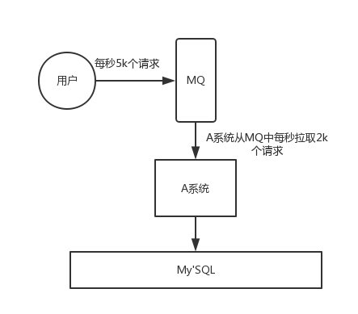
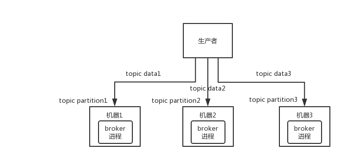
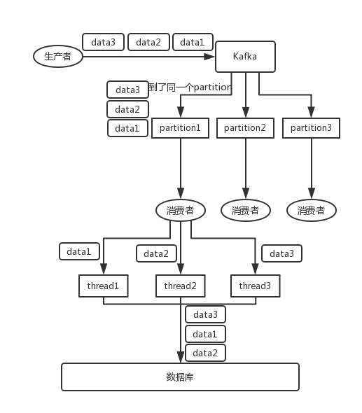
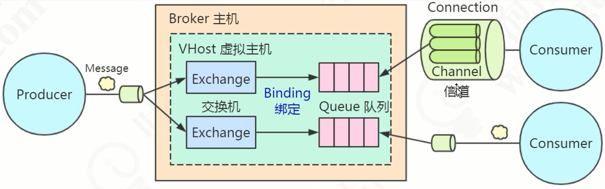

# MQ使用场景

## 解耦

通过MQ的发布订阅模型，A系统与其他系统彻底解耦

## 异步

## 削峰

# 消息队列的缺点

- 系统可用性降低

  MQ一挂，整套系统全崩，需要保证MQ的高可用

- 系统复杂度提高

  如何保证消息没有重复消费、如何处理消息丢失、如何保证消息传递的顺序性

- 一致性问题

# 主流MQ对比

| 特性                     | ActiveMQ                              | RabbitMQ                                           | RocketMQ                                                     | Kafka                                                        |
| ------------------------ | ------------------------------------- | -------------------------------------------------- | ------------------------------------------------------------ | ------------------------------------------------------------ |
| 单机吞吐量               | 万级，比 RocketMQ、Kafka 低一个数量级 | 同 ActiveMQ                                        | 10 万级，支撑高吞吐                                          | 10 万级，高吞吐，一般配合大数据类的系统来进行实时数据计算、日志采集等场景 |
| topic 数量对吞吐量的影响 |                                       |                                                    | topic 可以达到几百/几千的级别，吞吐量会有较小幅度的下降，这是 RocketMQ 的一大优势，在同等机器下，可以支撑大量的 topic | topic 从几十到几百个时候，吞吐量会大幅度下降，在同等机器下，Kafka 尽量保证 topic 数量不要过多，如果要支撑大规模的 topic，需要增加更多的机器资源 |
| 时效性                   | ms 级                                 | 微秒级，这是 RabbitMQ 的一大特点，延迟最低         | ms 级                                                        | 延迟在 ms 级以内                                             |
| 可用性                   | 高，基于主从架构实现高可用            | 同 ActiveMQ                                        | 非常高，分布式架构                                           | 非常高，分布式，一个数据多个副本，少数机器宕机，不会丢失数据，不会导致不可用 |
| 消息可靠性               | 有较低的概率丢失数据                  | 基本不丢                                           | 经过参数优化配置，可以做到 0 丢失                            | 同 RocketMQ                                                  |
| 功能支持                 | MQ 领域的功能极其完备                 | 基于 erlang 开发，并发能力很强，性能极好，延时很低 | MQ 功能较为完善，还是分布式的，扩展性好                      | 功能较为简单，主要支持简单的 MQ 功能，在大数据领域的实时计算以及日志采集被大规模使用 |

**总结**

- ActiveMQ的稳定版没经过大规模吞吐量场景的验证，社区也不是很活跃，重心主要放在ActiveMQ6上面，不推荐使用
- 中小型公司技术一般，可以选用RabbitMQ
- 大型公司，基础架构研发能力强，可以选用RocketMQ
- 大数据领域的实时计算、日志采集等场景，用Kafka是行业标准

# 高可用

## RabbitMQ

### 普通集群模式（无高可用）

多台机器启动多个RabbitMQ实例，每个集器启动一个，创建的queue只会放在一个RabbitMQ实例上，但是每个实例都有同步queue的元数据（queue的配置信息，可以通过元数据找到queue所在实例）。当消费时，如果连接到了另一个实例，那个实例会从queue所在的实例上拉取数据

**缺点**

- 每次随机连接实例拉取数据会有数据拉取的开销
- 固定连接queue所在实例消费数据，会导致单实例性能瓶颈

> 如果某个queue的实例宕机并且开启了消息持久化，消息不一定会丢，得等该实例恢复了后才可以从该实例拉取数据

### 镜像集群模式（高可用性）

镜像集群模式下创建的queue，每个实例都有queue的完整镜像

**缺点**

- 每次写消息都会同步到多个实例，性能开销大
- 没有拓展性，新增的实例也包含了queue的所有数据

## Kafka

Kafka基本架构：由多个broker组成，每个broker是一个节点；每创建一个topic可以划分为多个partition，每个partition可以存在不同broker上，每个partition只放一部分数据

天然的分布式消息队列，每个topic的数据分散放在多个机器上，每个机器都存放一部分数据

Kafka0.8以前是没有HA机制的，任何一个broker宕机，那个broker的partition就废了

Kafka0.8以后提供了HA机制，每个partition的数据都会同步到其他的机器上，形成自己的多个replica副本。所有replica会选举一个leader，生产和消费都跟leader打交道，其他都是follower

- 如果broker宕机，这个broker的partition在其他机器有副本，如果宕机的broker有某个partition的leader，其他follower会重新选举leader
- 写数据的时候，生产者向leader写数据，leader向磁盘写数据，其他follower向leader拉取数据，一旦同步好就向leader发生ACK，leader收到所有follower的ACK后，返回写成功的消息给生产者（其中一种模式，可调整）
- 消费的时候，从leader读取，只有当一条消息被所有follower都同步成功并返回ACK的时候，这个消息才能被消费者读取到

# 幂等性

MQ不能保证不重复消费，应该由开发保证

Kafka中每个消息写入队列都由一个offset，代表消息的序号，consumer消费数据后，定时定期会将已消费消息的offset提交，如果系统异常退出，还没来得及提交offset的消息会被重复消费

**重复消费可以通过保证幂等性解决**，需结合业务场景来看

- 数据写库，先通过主键查询，已经存在就不插入，用update
- 写Redis，天然幂等性，每次都是set
- 给生产者发生的每条数据都加入全局唯一ID，消费时先去比如Redis查询，没消费过就消费，ID写入Redis，消费过就不处理
- 利用数据库的唯一键保证重复数据不会插入多条

# 可靠性

MQ的数据不能丢

## RabbitMQ

设置持久化有两个步骤

- 创建queue的时候设置为持久化，保证持久化queue的元数据
- 发送消息的时候将消息的`deliveryMode`设置为2，将消息持久化

## Kafka

- 消费端丢失数据，可关闭自动提交offset
- Kafka丢失数据，如某个broker宕机，重新参与leader选举的follower数据还未同步完，起码设置4个参数：
  - 给topic设置`replication.factor`参数：值必须大于1，即每个paritition至少有两个副本
  - Kafka 服务端设置 `min.insync.replicas` 参数：值必须大于 1，要求一个 leader 至少感知到有至少一个 follower 还跟自己保持联系
  - producer 端设置 `acks=all`：要求每条数据，必须是**写入所有 replica 之后，才能认为是写成功了**。
  - producer 端设置 `retries=MAX`：这个是**要求一旦写入失败，就无限重试**
- 生产者丢失数据
  - `acks=all`
  - `retries=MAX`

# 顺序性

## RabbitMQ

解决方案，一个queue对应一个consumer，consumer内部用内存队列做排队，分发给不同的worker处理

## Kafka

比如一个 topic 包含三个 partition，生产者写的时指定唯一 key，可以保证 partition 中的数据从写入到取出都是有序的

问题出在消费的时候单线程处理吞吐量太低，多线程处理顺序会乱

解决方案：写N个内存队列，具有相同 key 的数据都到同一个内存队列，对于N个线程，每个线程分别消费一个内存队列

# 延时以及过期失效

**大量消息在MQ里积压了几个小时还没解决**

只能临时紧急扩容，以下步骤和思路

- 先修复 consumer 的问题，确保其恢复消费速度，然后将现有 consumer 都停掉。
- 新建一个 topic，partition 是原来的 10 倍，临时建立好原先 10 倍的 queue 数量。
- 然后写一个临时的分发数据的 consumer 程序，这个程序部署上去消费积压的数据，**消费之后不做耗时的处理**，直接均匀轮询写入临时建立好的 10 倍数量的 queue。
- 接着临时征用 10 倍的机器来部署 consumer，每一批 consumer 消费一个临时 queue 的数据。这种做法相当于是临时将 queue 资源和 consumer 资源扩大 10 倍，以正常的 10 倍速度来消费数据。
- 等快速消费完积压数据之后，**得恢复原先部署的架构**，**重新**用原先的 consumer 机器来消费消息

**MQ的消息过期失效**

使用RabbitMQ可以设置过期时间，这个时候会丢失大量数据

采用**批量重导**，直接丢弃数据，晚上查找丢失的数据补录

**MQ的消息满了**

上述方案一执行太晚导致，同样晚上补录

------

# RabbitMQ入门

## RabbitMQ简介

RabbitMQ 是采用 Erlang 语言实现 AMQP(Advanced Message Queuing Protocol，高级消息队列协议）的消息中间件，它最初起源于金融系统，用于在分布式系统中存储转发消息

## RabbitMQ核心概念

RabbitMQ整体模型架构（像交换机模型）

