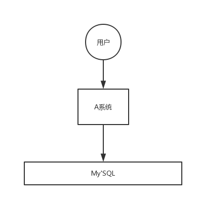
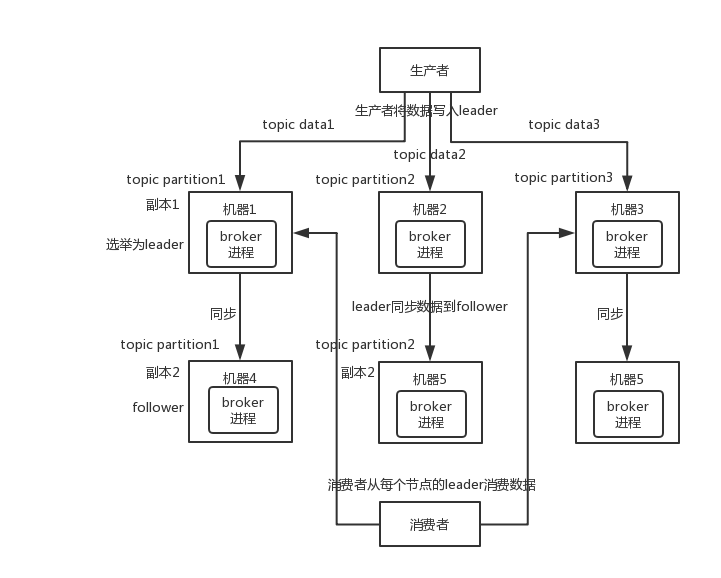

# MQ使用场景

## 解耦

通过MQ的发布订阅模型，A系统与其他系统彻底解耦

## 异步

## 削峰

# 消息队列的缺点

- 系统可用性降低

  MQ一挂，整套系统全崩，需要保证MQ的高可用

- 系统复杂度提高

  如何保证消息没有重复消费、如何处理消息丢失、如何保证消息传递的顺序性

- 一致性问题

# 主流MQ对比

| 特性                     | ActiveMQ                              | RabbitMQ                                           | RocketMQ                                                     | Kafka                                                        |
| ------------------------ | ------------------------------------- | -------------------------------------------------- | ------------------------------------------------------------ | ------------------------------------------------------------ |
| 单机吞吐量               | 万级，比 RocketMQ、Kafka 低一个数量级 | 同 ActiveMQ                                        | 10 万级，支撑高吞吐                                          | 10 万级，高吞吐，一般配合大数据类的系统来进行实时数据计算、日志采集等场景 |
| topic 数量对吞吐量的影响 |                                       |                                                    | topic 可以达到几百/几千的级别，吞吐量会有较小幅度的下降，这是 RocketMQ 的一大优势，在同等机器下，可以支撑大量的 topic | topic 从几十到几百个时候，吞吐量会大幅度下降，在同等机器下，Kafka 尽量保证 topic 数量不要过多，如果要支撑大规模的 topic，需要增加更多的机器资源 |
| 时效性                   | ms 级                                 | 微秒级，这是 RabbitMQ 的一大特点，延迟最低         | ms 级                                                        | 延迟在 ms 级以内                                             |
| 可用性                   | 高，基于主从架构实现高可用            | 同 ActiveMQ                                        | 非常高，分布式架构                                           | 非常高，分布式，一个数据多个副本，少数机器宕机，不会丢失数据，不会导致不可用 |
| 消息可靠性               | 有较低的概率丢失数据                  | 基本不丢                                           | 经过参数优化配置，可以做到 0 丢失                            | 同 RocketMQ                                                  |
| 功能支持                 | MQ 领域的功能极其完备                 | 基于 erlang 开发，并发能力很强，性能极好，延时很低 | MQ 功能较为完善，还是分布式的，扩展性好                      | 功能较为简单，主要支持简单的 MQ 功能，在大数据领域的实时计算以及日志采集被大规模使用 |

**总结**

- ActiveMQ的稳定版没经过大规模吞吐量场景的验证，社区也不是很活跃，重心主要放在ActiveMQ6上面，不推荐使用
- 中小型公司技术一般，可以选用RabbitMQ
- 大型公司，基础架构研发能力强，可以选用RocketMQ
- 大数据领域的实时计算、日志采集等场景，用Kafka是行业标准

# 高可用

## RabbitMQ

### 普通集群模式（无高可用）

多台机器启动多个RabbitMQ实例，每个集器启动一个，创建的queue只会放在一个RabbitMQ实例上，但是每个实例都有同步queue的元数据（queue的配置信息，可以通过元数据找到queue所在实例）。当消费时，如果连接到了另一个实例，那个实例会从queue所在的实例上拉取数据

**缺点**

- 每次随机连接实例拉取数据会有数据拉取的开销
- 固定连接queue所在实例消费数据，会导致单实例性能瓶颈

> 如果某个queue的实例宕机并且开启了消息持久化，消息不一定会丢，得等该实例恢复了后才可以从该实例拉取数据

### 镜像集群模式（高可用性）

镜像集群模式下创建的queue，每个实例都有queue的完整镜像

**缺点**

- 每次写消息都会同步到多个实例，性能开销大
- 没有拓展性，新增的实例也包含了queue的所有数据

## Kafka

Kafka基本架构：由多个broker组成，每个broker是一个节点；每创建一个topic可以划分为多个partition，每个partition可以存在不同broker上，每个partition只放一部分数据

天然的分布式消息队列，每个topic的数据分散放在多个机器上，每个机器都存放一部分数据

Kafka0.8以前是没有HA机制的，任何一个broker宕机，那个broker的partition就废了

Kafka0.8以后提供了HA机制，每个partition的数据都会同步到其他的机器上，形成自己的多个replica副本。所有replica会选举一个leader，生产和消费都跟leader打交道，其他都是follower

- 如果broker宕机，这个broker的partition在其他机器有副本，如果宕机的broker有某个partition的leader，其他follower会重新选举leader
- 写数据的时候，生产者向leader写数据，leader向磁盘写数据，其他follower向leader拉取数据，一旦同步好就向leader发生ACK，leader收到所有follower的ACK后，返回写成功的消息给生产者（其中一种模式，可调整）
- 消费的时候，从leader读取，只有当一条消息被所有follower都同步成功并返回ACK的时候，这个消息才能被消费者读取到

# 幂等性

