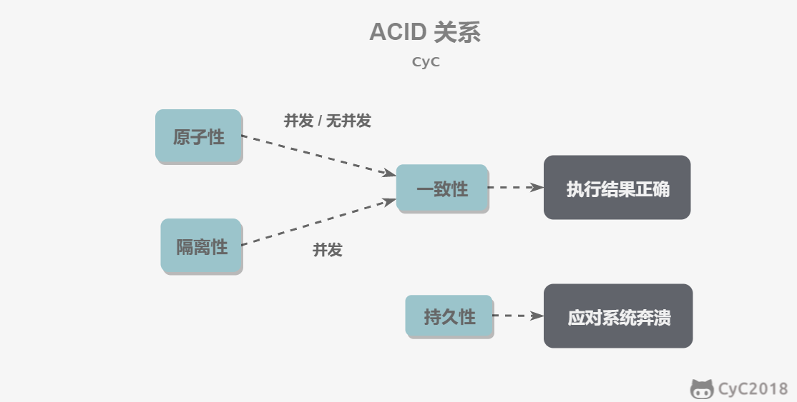
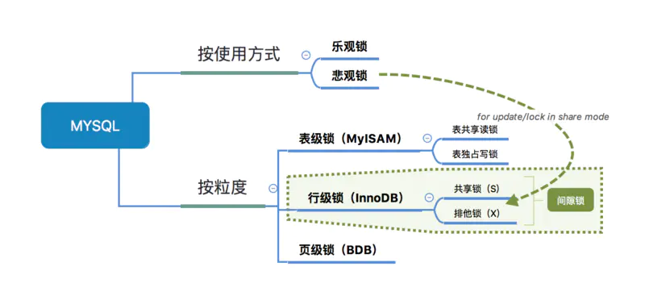

# 一、事务

## ACID

- 原子性（Atomicity）

> 回滚可以用回滚日志（Undo Log）实现，回滚日志记录着事务所执行的修改操作，反向执行达到回滚效果

- 一致性（Consistency）
- 隔离性（Isolation）
- 持久性（Durability）

> 系统崩溃时可以用重做日志（Redo Log）进行恢复，实现持久性，与回滚日志记录数据的逻辑修改不同，重做日志记录的是数据页的物理修改

ACID关系：



AUTOCOMMIT：

MySQL默认采用自动提交模式。如果不显示使用`START TRANSACTION`来开始一个事务，每个查询都会被当作一个事务自动提交

## 并发一致性问题

- 丢失修改


- 脏读


- 不可重复读


- 幻读


## 隔离级别

|          | 脏读    | 不可重复读 | 幻读    |
| -------- | ------- | ---------- | ------- |
| 未提交读 | &radic; | &radic;    | &radic; |
| 已提交读 | &times; | &radic;    | &radic; |
| 可重复读 | &times; | &times;    | &radic; |
| 可串行化 | &times; | &times;    | &times; |

**丢失修改**：

- 任何隔离级别下，都不会导致数据库理论意义下的丢失修改，任何隔离级别对行更新操作时都会对行或其他粒度的对象加锁

- 生产应用中可能出现逻辑意义的丢失修改，比如：

  1）事务T1查询一行数据，放入本地内存并显示给用户U1

  2）事务T2也查询该行数据，并显示给用户U2

  3）U1修改该行数据，更新数据库并提交

  4）U2修改该行数据，更新数据库并提交

  此时U1修改丢失，银行转账也存在这种问题，可通过U盾解决

  **数据库层面解决**，两种方式：

  - 悲观锁

  将操作变为串行化，在步骤1和步骤2都加上X锁
  
  ```mysql
begin;
  select * from account where id = 1 for update;
  update account set balance=150 where id =1;
  commit;
  ```
  
  > 两个事务都直接update也不会存在丢失修改，但现实场景有可能先查数据做业务判断，再修改
  
  - 乐观锁
  
  

## MVVC

多版本并发控制，

# 二.锁




### 1.锁

- 共享锁（Shared）：S锁/读锁
- 互斥锁（Exclusive）：X锁/写锁

> 仅读读兼容

### 2.意向锁

使用意向锁（Intention Locks）是为了支持不同粒度的加锁操作，该意向锁为**表级锁**

- 意向共享锁：IS
- 意向互斥锁：IX

# 二、索引

## B+Tree原理

### 1.数据结构：

B Tree（Balance Tree）：平衡树，是一颗查找树，并且所有叶子节点位于同一层

B+ Tree：基于B Tree和叶子节点顺序访问（从左到右非递增排列）指针进行实现，具有B Tree的平衡性，并且通过顺序访问指针来提高范围查询的性能

MySQL中：


- 各数据页组成一个双向链表
- 每个数据页中的记录组成一个单向链表

### 2.操作


进行查找时，首先根据根节点递归二分查找，直到查到叶子节点，然后在叶子节点二分查找，找到key对应的data

MySQL中：


> record_type：0：普通用户记录（用户自定义的列+InnoDB的隐藏列），1：目录项记录（主键值+页码），2：最小记录，3：最大记录

插入删除操作会破坏平衡树的平衡性，因此在插入删除操作之后，需要对树进行一个分裂、合并、旋转等操作来维护平衡性。

## 哈希索引


本质是把key换算成哈希值，根据哈希值定位，缺陷：

- 无法排序
- 不支持最左匹配原则
- hash碰撞
- 不支持范围查询

> InnoDB中是自适应哈希索引，即由引擎自动优化创建

## 索引优化

### 1.独立的列

索引列不能是表达式的一部分，也不能是函数的参数，反例：

```mysql
SELECT actor_id FROM sakila.actor WHERE actor_id + 1 = 5;
```

### 2.多列索引

需要多个列作为查询条件时使用多列索引比多个单列索引性能更高

### 3.前缀索引和索引选择性

选择性最强的索引放在前面

> 选择性：不重复的索引值个数和记录总数的比值，公式count(distinct col)/count(*)，选择性越高，区分度越高，查询效率越高

对于BLOB、TEXT和VARCHAR类型的列，必须使用前缀索引，如`value%`，前缀长度由索引选择性确定，例子：

```mysql
mysql> select 1.0*count(distinct name)/count(*) from test;
+-------------------------------------------+
| 1.0*count(distinct name)/count(*) |
+-------------------------------------------+
|                                   1.00000 |
+-------------------------------------------+
1 row in set (0.00 sec)

mysql> select 1.0*count(distinct left(name,1))/count(*) from test;
+-------------------------------------------+
| 1.0*count(distinct left(name,1))/count(*) |
+-------------------------------------------+
|                                   0.75000 |
+-------------------------------------------+
1 row in set (0.00 sec)

mysql> select 1.0*count(distinct left(name,2))/count(*) from test;
+-------------------------------------------+
| 1.0*count(distinct left(name,2))/count(*) |
+-------------------------------------------+
|                                   0.75000 |
+-------------------------------------------+
1 row in set (0.00 sec)

mysql> select 1.0*count(distinct left(name,3))/count(*) from test;
+-------------------------------------------+
| 1.0*count(distinct left(name,3))/count(*) |
+-------------------------------------------+
|                                   1.00000 |
+-------------------------------------------+
1 row in set (0.00 sec)
```

创建索引：

```mysql
mysql> alter table test add key(name(3));
Query OK, 4 rows affected (0.15 sec)
Records: 4  Duplicates: 0  Warnings: 0
```

### 5.覆盖索引

索引包含所有需要查询的字段

# 3.存储引擎

# 

# 5.SQL

