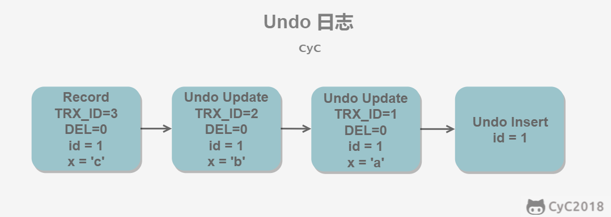

# 一、事务

## ACID

- 原子性（Atomicity）

> 回滚可以用回滚日志（Undo Log）实现，回滚日志记录着事务所执行的修改操作，反向执行达到回滚效果

- 一致性（Consistency）
- 隔离性（Isolation）
- 持久性（Durability）

> 系统崩溃时可以用重做日志（Redo Log）进行恢复，实现持久性，与回滚日志记录数据的逻辑修改不同，重做日志记录的是数据页的物理修改

ACID关系：


## 事务的实现

事务的隔离性由锁实现，原子性和持久性由redo log实现，一致性由undo log实现

- redo log通常是物理日志，记录的是数据页的物理修改，用来恢复提交后的物理数据页（只能恢复到最后一次提交的位置），恢复速度比逻辑日志快很多
- undo log用来帮助事务回滚及MVCC中记录行的多个版本，一般是逻辑日志

### redo log

重做日志包括两部分

- 重做日志缓存（redo log buffer），易失
- 重做日志文件（redo log file），持久

**Force Log at Commit机制**

事务提交时，必须先将事务的所有日志写入redo log file和undo log file进行持久化，待事务的COMMIT操作完成才算完成

## 并发一致性问题

- 丢失修改


- 脏读


- 不可重复读


- 幻读


## 隔离级别

|          | 脏读    | 不可重复读 | 幻读    |
| -------- | ------- | ---------- | ------- |
| 未提交读 | &radic; | &radic;    | &radic; |
| 已提交读 | &times; | &radic;    | &radic; |
| 可重复读 | &times; | &times;    | &radic; |
| 可串行化 | &times; | &times;    | &times; |

**丢失修改**：

- 任何隔离级别下，都不会导致数据库理论意义下的丢失修改，任何隔离级别对行更新操作时都会对行或其他粒度的对象加锁

- 生产应用中可能出现逻辑意义的丢失修改，比如：

  1）事务T1查询一行数据，放入本地内存并显示给用户U1

  2）事务T2也查询该行数据，并显示给用户U2

  3）U1修改该行数据，更新数据库并提交

  4）U2修改该行数据，更新数据库并提交

  此时U1修改丢失，银行转账也存在这种问题，可通过U盾解决

  **数据库层面解决**，使用**悲观锁**：

  将操作变为串行化，在步骤1和步骤2都加上X锁

  ```mysql
  begin;
  select * from account where id = 1 for update;
  update account set balance=150 where id =1;
  commit;
  ```

  因为加上了X锁，步骤2只能在步骤1和3完成后，再完成步骤4

  > 两个事务都直接update也不会存在丢失修改，但现实场景有可能先查数据做业务判断，再修改。

  **所谓的乐观锁版本号控制无法实现**，因为在可重复读隔离级别下，vesion只能读到事务开始的版本号，不会改变
  
  `AUTOCOMMIT`：
  
  MySQL默认采用自动提交模式。如果不显示使用`BEGIN`,`START TRANSACTION`或`AUTOCOMMIT=0`来开始一个事务，每个查询都会被当作一个事务自动提交

# 二.锁


## 锁粒度

- 行级锁：开销大，加锁慢，会出现死锁；并发度高
- 表级锁：开销小，加锁快，不会出现死锁；并发度低

## 锁类型

### 1.读写锁

- 共享锁（Shared）：S锁/读锁
- 互斥锁（Exclusive）：X锁/写锁

**行锁是通过给索引上的索引项加锁实现的，只有通过索引条件索引数据，InnoDB才能使用行级锁，否则将使用表锁**

> 读写锁间都是仅读读兼容

### 3.意向锁

使用意向锁（Intention Locks）是为了支持不同粒度的加锁操作，该意向锁为**表级锁**

- 意向共享锁：IS
- 意向互斥锁：IX

|      | X       | IX      | S       | IS      |
| ---- | ------- | ------- | ------- | ------- |
| X    | &times; | &times; | &times; | &times; |
| IX   | &times; | &radic; | &times; | &radic; |
| S    | &times; | &times; | &radic; | &radic; |
| IS   | &times; | &radic; | &radic; | &radic; |

## 锁算法

行锁的三种算法：

- Record Lock：锁定记录上的索引

> 如果表没有设置索引，InnoDB会自动在主键上创建因此的聚集索引，因此Record Lock依然可以使用

- Gap Lock：锁定索引间的间隙，但不包括索引本身
- Next-Key Lock：锁定索引已经之间的间隙，解决幻读问题，如果存在索引10，11，13，20，则锁定区间为

```
(-∞, 10]
(10, 11]
(11, 13]
(13, 20]
(20, +∞)
```

可重复读下使用`Next-Key Lock`，当查询的索引含有唯一索引时，InnoDB会将其优化，降级为`Record Lock`

已提交读下使用`Record Lock`

## 封锁协议

### 1.三级封锁协议

- 一级封锁协议：事务T要修改数据A时必须加X锁，直到T结束释放，可以解决丢失修改问题
- 二级封锁协议：一级的基础，要求读数据A时必须加S锁，**读取完就释放**，可以解决脏读
- 三级封锁协议：一级的基础，要求读取数据A时必须加S锁，**直到事务结束才释放**，可以解决不可重复读

理论上的事务的三级封锁协议，InnoDB未采用

### 2.两段锁协议

事务执行过程，随时可以执行锁定，事务结束（commit/rollback）后锁在同一时刻释放。可以保证可串行化调度

```
lock-x(A)...lock-s(B)...lock-s(C)...unlock(A)...unlock(C)...unlock(B)
```

> 可串行化调度：通过并发控制使得并发执行的事务结果和串行执行的结果一致

**MySQL的InnoDB采用两阶段锁协议**

## 隐式与显示锁定

- 隐式锁定：InnoDB根据隔离级别在需要加锁的时候自动加锁

- 显示锁定：InnoDB支持

  - ```mysql
    SELECT ... LOCK IN SHARE MODE -- S锁
    ```

  - ```mysql
    SELECT ... FOR UPDATE -- X锁
    ```

> 一致性非锁定读下，`SELECT ... FOR UPDATE`无法阻止`SELECT` 的读取，依然会读快照

**MySQL也支持`LOCK TABLES` 和`UNLOCK TABLES`语句，在服务器层实现，除了在`AUTOCOMMIT=0`时可以使用，其他时候不建议使用**

## 一致性非锁定读

InnoDB通过行多版本控制的方式读取当前执行时间数据库中行的数据，即如果当前读取的行被X锁定，这时读取操作不会阻塞等待X锁的释放，会直接读取行的快照数据

### MVCC

InnoDB的已提交读和可重复读隔离级别下均使用一致性非锁定读，两种隔离级别读取不同的版本快照数据，称为多版本并发控制

- 已提交读：读取行最新的版本快照数据
- 可重复读：读取事务开始时的版本快照数据

#### 实现

MVVC通过增加版本号和Undo日志实现

**版本号**

- 系统版本号SYS_ID：递增数字，每开启一个事务就自动递增
- 事务版本号TRX_ID：事务开始时的系统版本号

**Undo日志**

快照存储在Undo日志中，通过回滚指针ROLL_PTR把一个数据行的所有快照连接起来

```mysql
INSERT INTO t(id, x) VALUES(1, "a");
UPDATE t SET x="b" WHERE id=1;
UPDATE t SET x="c" WHERE id=1;
```

MySQL的AUTOCOMMIT机制，这里没有显示开启事务，所以是三个事务，快照中除了记录事务版本号操作外还记录了DEL字段，DELECT时设置为1



**ReadView**

MVCC维护了一个ReadView结构，包含了当前系统未提交的事务列表TRX_IDS，进行SELECT时

- TRX_ID < TRX_ID_MIN，该快照在当前所有未提交事务之前进行更改的，可以使用。
- TRX_ID > TRX_ID_MAX，该快照是在事务启动之后被更改的，不可使用。
- TRX_ID_MIN <= TRX_ID <= TRX_ID_MAX，需要根据隔离级别再进行判断：
  - 提交读：该快照对应的事务还未提交，则该快照不可使用。否则表示已经提交，可以使用。
  - 可重复读：都不可以使用。因为如果可以使用的话，那么其它事务也可以读到这个数据行快照并进行修改，那么当前事务再去读这个数据行得到的值就会发生改变，也就是出现了不可重复读问题。

## 一致性锁定读

即显示锁定

- ```mysql
  SELECT ... LOCK IN SHARE MODE -- S锁
  ```

- ```mysql
  SELECT ... FOR UPDATE -- X锁
  ```

**注意**

- 对于一致性非锁定读，即使读取的行已被执行了`SELECT ... FOR UPDATE`，也不能阻止`SELECT`的读取
- 由于`AUTOCOMMIT`，使用一致性锁定读时，必须加上`BEGIN`,`START TRANSACTION`或者SET `AUTOCOMMIT`=0
- 对于`SELECT ... FOR UPDATE`，使用上索引时是加行锁，反之加表锁

## 死锁

两个或两个以上的事务执行过程中，因争夺锁资源而造成的相互等待的现象

解决

- 超时：超时后回滚，被动、无权重
- 等待图：通过锁的信息链表和事务等待链表检测死锁，并回滚undo量较小的事务

# 二、索引

## B+Tree原理

### 1.数据结构：

二叉查找树=》平衡二叉树=》B树=》B+树

二叉查找树：左子树<根<右子树的键值（子树也是），最多两个子节点，没有重复键值的节点

平衡二叉树（AVL Tree）：二叉查找树+任何节点的两子树高度最大差为1

> 查询速度很快，不过插入、删除、更新操作需进行左旋、右旋维护，开销较高

B Tree（Balance Tree）：平衡的多叉查找树，是一颗多叉查找树，并且所有叶子节点位于同一层（除此还有复杂的节点个数限制）

> 特点：B树相对于平衡二叉树的不同是，每个节点包含的关键字增多了，特别是在B树应用到数据库中的时候，数据库充分利用了磁盘块的原理（磁盘数据存储是采用块的形式存储的，每个块的大小为4K/8K/16K，每次IO进行数据读取时，同一个磁盘块的数据可以一次性读取出来）把节点大小限制和充分使用在磁盘快大小范围；把树的节点关键字增多后树的层级比原来的二叉树少了，减少数据查找的次数和复杂度

B+ Tree：B树+ISAM（索引顺序访问方法），具有B Tree的平衡性，并且通过顺序访问指针来提高范围查询的性能

> 特点：
>
> 1、B+**树的层级更少**：相较于B树B+每个**非叶子**节点存储的关键字数更多，树的层级更少所以查询数据更快；
>
> 2、B+**树查询速度更稳定**：B+所有关键字数据地址都存在**叶子**节点上，所以每次查找的次数都相同所以查询速度要比B树更稳定;
>
> 3、B+**树天然具备排序功能：**B+树所有的**叶子**节点数据构成了一个有序链表，在查询大小区间的数据时候更方便，数据紧密性很高，缓存的命中率也会比B树高。
>
> 4、B+**树全节点遍历更快：**B+树遍历整棵树只需要遍历所有的**叶子**节点即可，，而不需要像B树一样需要对每一层进行遍历，这有利于数据库做全表扫描。

### 2.操作


进行查找时，首先根据根节点递归二分查找，直到查到叶子节点，然后在叶子节点二分查找，找到key对应的data

插入删除操作会破坏平衡树的平衡性，因此在插入删除操作之后，需要对树进行一个分裂、合并、旋转等操作来维护平衡性。

### 3. 与红黑树的比较

红黑树等平衡树也可以用来实现索引，但是文件系统及数据库系统普遍采用 B+ Tree 作为索引结构，主要有以下两个原因：

（一）**更少的查找次数**

平衡树查找操作的时间复杂度和树高 h 相关，O(h)=O(logdN)，其中 d 为每个节点的出度。

红黑树的出度为 2，而 B+ Tree 的出度一般都非常大，所以红黑树的树高 h 很明显比 B+ Tree 大非常多，查找的次数也就更多。

（二）**利用磁盘预读特性**

为了减少磁盘 I/O 操作，磁盘往往不是严格按需读取，而是每次都会预读。预读过程中，磁盘进行顺序读取，顺序读取不需要进行磁盘寻道，并且只需要很短的磁盘旋转时间，速度会非常快。

操作系统一般将内存和磁盘分割成固定大小的块（默认16K，可调），每一块称为一页，内存与磁盘以页为单位交换数据。数据库系统将索引的一个节点的大小设置为页的大小，使得一次 I/O 就能完全载入一个节点。并且可以利用预读特性，相邻的节点也能够被预先载入。

## MySQL中B+Tree索引

### 1.B+Tree索引


- 各数据页组成一个双向链表
- 每个数据页中的记录组成一个单向链表


> record_type：0：普通用户记录（用户自定义的列+InnoDB的隐藏列），1：目录项记录（主键值+页码），2：最小记录，3：最大记录

#### 聚集索引

按照每张表的主键构造一棵B+树，叶子节点存放的即为整张表的行数据，也将聚集索引的叶子节点称为数据页，一张表只能拥有一个聚集索引

#### 非聚集索引

非聚集索引的叶子节点只存放了主键，需要回表查询完整记录，**但是覆盖索引除外**，即索引包含所有需要查询的字段

### 2.哈希索引


本质是把key换算成哈希值，根据哈希值定位，缺陷：

- 无法排序
- 不支持联合索引的最左匹配原则
- hash碰撞
- 不支持范围查询

> InnoDB中是自适应哈希索引，即由引擎自动优化创建

### 3.全文索引

B+树查找`‘%value%’`会让索引失效，全文索引可以搜索关键字，实现快速查找

查找条件使用 MATCH AGAINST，而不是普通的 WHERE。

全文索引使用**倒排索引**实现，它记录着关键词到其所在文档的映射。

InnoDB 存储引擎在 MySQL 5.6.4 版本中也开始支持全文索引。

## 索引优化

### 1.独立的列

索引列不能是表达式的一部分，也不能是函数的参数，反例：

```mysql
SELECT actor_id FROM sakila.actor WHERE actor_id + 1 = 5;
```

### 2.多列索引

需要多个列作为查询条件时使用多列索引比多个单列索引性能更高

### 3.前缀索引和索引选择性

选择性最强的索引放在前面

> 选择性：不重复的索引值个数和记录总数的比值，公式count(distinct col)/count(*)，选择性越高，区分度越高，查询效率越高

对于BLOB、TEXT和VARCHAR类型的列，必须使用前缀索引，如`value%`，前缀长度由索引选择性确定，例子：

```mysql
mysql> select 1.0*count(distinct name)/count(*) from test;
+-------------------------------------------+
| 1.0*count(distinct name)/count(*) |
+-------------------------------------------+
|                                   1.00000 |
+-------------------------------------------+
1 row in set (0.00 sec)

mysql> select 1.0*count(distinct left(name,1))/count(*) from test;
+-------------------------------------------+
| 1.0*count(distinct left(name,1))/count(*) |
+-------------------------------------------+
|                                   0.75000 |
+-------------------------------------------+
1 row in set (0.00 sec)

mysql> select 1.0*count(distinct left(name,2))/count(*) from test;
+-------------------------------------------+
| 1.0*count(distinct left(name,2))/count(*) |
+-------------------------------------------+
|                                   0.75000 |
+-------------------------------------------+
1 row in set (0.00 sec)

mysql> select 1.0*count(distinct left(name,3))/count(*) from test;
+-------------------------------------------+
| 1.0*count(distinct left(name,3))/count(*) |
+-------------------------------------------+
|                                   1.00000 |
+-------------------------------------------+
1 row in set (0.00 sec)
```

创建索引：

```mysql
mysql> alter table test add key(name(3));
Query OK, 4 rows affected (0.15 sec)
Records: 4  Duplicates: 0  Warnings: 0
```

### 5.覆盖索引

索引包含所有需要查询的字段

### 6.最左匹配原则


# 3.存储引擎

# 

# 5.SQL

