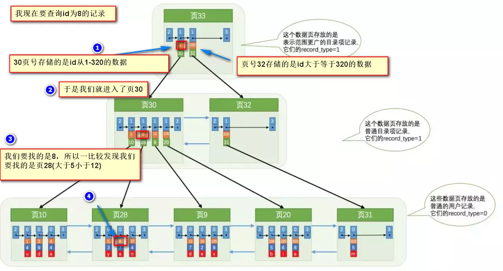
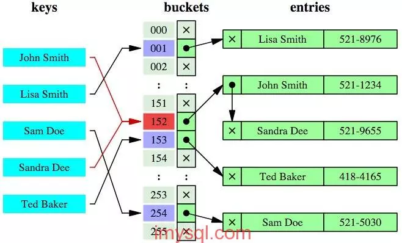

# 一、MySQL逻辑架构


# 二、索引

## B+Tree原理

### 1.数据结构：

B Tree（Balance Tree）：平衡树，是一颗查找树，并且所有叶子节点位于同一层

B+ Tree：基于B Tree和叶子节点顺序访问（从左到右非递增排列）指针进行实现，具有B Tree的平衡性，并且通过顺序访问指针来提高范围查询的性能

MySQL中：


- 各数据页组成一个双向链表
- 每个数据页中的记录组成一个单向链表

### 2.操作


进行查找时，首先根据根节点递归二分查找，直到查到叶子节点，然后在叶子节点二分查找，找到key对应的data

MySQL中：



> record_type：0：普通用户记录（用户自定义的列+InnoDB的隐藏列），1：目录项记录（主键值+页码），2：最小记录，3：最大记录

插入删除操作会破坏平衡树的平衡性，因此在插入删除操作之后，需要对树进行一个分裂、合并、旋转等操作来维护平衡性。

## 哈希索引



本质是把key换算成哈希值，根据哈希值定位，缺陷：

- 无法排序
- 不支持最左匹配原则
- hash碰撞
- 不支持范围查询

> InnoDB中是自适应哈希索引，即由引擎自动优化创建

## 索引优化

### 1.独立的列

索引列不能是表达式的一部分，也不能是函数的参数，反例：

```mysql
SELECT actor_id FROM sakila.actor WHERE actor_id + 1 = 5;
```

### 2.多列索引

需要多个列作为查询条件时使用多列索引比多个单列索引性能更高

### 3.索引列的顺序

选择性最强的索引放在前面

> 选择性：不重复的索引值个数和记录总数的比值，公式count(distinct col)/count(*)，选择性越高，区分度越高，查询效率越高

### 4.前缀索引

对于BLOB、TEXT和VARCHAR类型的列，必须使用前缀索引，如`value%`，前缀长度由索引选择性确定，例子：

```mysql

mysql> select 1.0*count(distinct left(name,1))/count(*) from test;
+-------------------------------------------+
| 1.0*count(distinct left(name,1))/count(*) |
+-------------------------------------------+
|                                   0.75000 |
+-------------------------------------------+
1 row in set (0.00 sec)

mysql> select 1.0*count(distinct left(name,2))/count(*) from test;
+-------------------------------------------+
| 1.0*count(distinct left(name,2))/count(*) |
+-------------------------------------------+
|                                   0.75000 |
+-------------------------------------------+
1 row in set (0.00 sec)

mysql> select 1.0*count(distinct left(name,3))/count(*) from test;
+-------------------------------------------+
| 1.0*count(distinct left(name,3))/count(*) |
+-------------------------------------------+
|                                   1.00000 |
+-------------------------------------------+
1 row in set (0.00 sec)
```

创建索引：

```mysql
mysql> alter table test add key(name(4));
Query OK, 4 rows affected (0.15 sec)
Records: 4  Duplicates: 0  Warnings: 0
```

### 5.覆盖索引

索引包含所有需要查询的字段