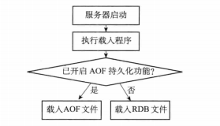
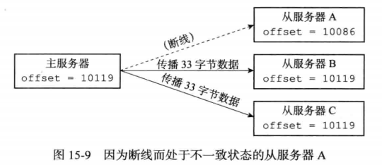
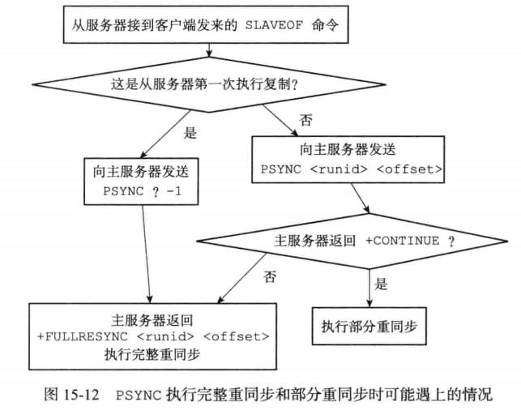
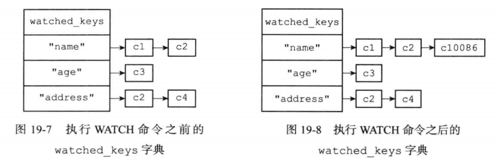

## 线程模型

redis内部使用文件事件处理器，这个**文件事件处理器是单线程**的，所以才说redis是单线程的模型。它采用IO多路复用机制监听多个socket，根据socket上的事件选择相应的事件处理器去处理

文件事件处理器的结构

- 

## 持久化

- RDB：快照，一次全量备份，数据紧凑的二进制文件
  - save：保存快照，同步，会阻塞客户端指令
  - bgsave：后台保存快照，异步非阻塞，通过fork()函数开启**子进程**执行
  - save配置：默认开启

```
save 900 1		#900s内至少对数据库进行了1次修改
save 300 10
save 60 10000
```

> 原理：调用fork()函数后会开启一个子进程，与父进程共享数据，子进程对数据结构进行遍历读取并序列化写入磁盘，父进程需要持续服务客户端请求，当需要修改数据时，会采用操作系统的COW（copy on write）机制，将被共享的数据段（由操作系统的页面组成）页面复制一份，并在复制的页面进行修改

- AOF（append-only file）：日志，连续的增量备份，顺序记录对内存的修改指令
  - 原理
    - 命令追加：执行写命令，并追加到缓冲区的末尾
    - 文件写入与同步：根据配置appendfsync的值判断是否将缓冲区的内容写入和保存到AOF文件
  - **AOF重写**：长期运行使AOF日志越来越大，导致重放时间变长，需要进行AOF重写，对应指令BGREWRITEAOF指令。
    - 开辟一个子进程对内存进行遍历转换成一系列的Redis操作指令，并写入新的AOF文件
    - 同时此期间父进程执行写操作时会将指令记录到重写缓冲区
    - 子进程写入完成后会将重写缓冲区的指令追加到新AOF文件，最终替换AOF文件

```
appendonly yes  #开启aof
appendfsync always    #每次有数据修改发生时都会写入AOF文件,这样会严重降低Redis的速度
appendfsync everysec  #（默认值）每秒钟同步一次，显示地将多个写命令同步到硬盘
appendfsync no        #让操作系统决定何时进行同步
```

**服务器载入文件时的启动流程**



**Redis 4.0 对于持久化机制的优化**

Redis 4.0 开始支持 RDB 和 AOF 的混合持久化（默认关闭，可以通过配置项 `aof-use-rdb-preamble` 开启）。如果把混合持久化打开，**AOF 重写的时候就直接把 RDB 的内容写到 AOF 文件开头**

- 优点：快速加载同时避免丢失过多的数据
- 缺点：AOF 里面的 RDB 部分是压缩格式不再是 AOF 格式，可读性较差

## 过期数据删除策略

数据删除策略目标是在内存占用和CPU占用之间寻找平衡

- 定时删除（处理器性能换取存储空间）：创建一个定时器，当key设置有过期时间且已经过期则立即删除键
  - 优点：节约内存
  - 缺点：CPU压力大，无论CPU负载量多高都会占用CPU，会影响redis服务器的响应速度和吞吐量
- 惰性删除（存储空间换取处理器性能）：数据过期时不处理，访问该数据时，如果发现过期则删除，返回不存在
  - 优点：节约CPU性能
  - 缺点内存压力大
- 定期删除：

## 分布式锁

Redis做分布式锁的问题

- 死锁：如果解锁时删除键失败，将陷入死锁，所以锁必须设置过期时间，且设置锁和过期时间的操作必须具有原子性

  > Redis2.8以后加入了set的参数设置nx和ex，相当于setnx和expire组合在一起的原子操作

- 超时：锁过期后

  > 可通过给value设置随机值，删除先判断valueLUA脚本

- 可重入性：

## 复制

- Redis2.8以前的复制功能不能高效处理断线后的重复制情况（全部复制），之后加入了部分重同步解决

- 部分重同步包括3部分

  - 复制偏移量：主从双方分别维护一个复制偏移量，主向从广播或者从接收主N个字节的数据，就将自己的偏移量+N

  

  - 复制缓冲区：主维护固定长度的队列，默认1M，为每个字节记录相应的复制偏移量，队列满的时候，新入队的数据会让旧数据出队

  > 缓冲区大小为 从断线重连的平均时间*主平均每秒产生的写命令数据量 时效果最优

  - 服务器运行ID

- psync的执行流程



- 主通过向从广播命令来更新从状态，从通过向主发送命令来进行心跳检测和命令丢失检测（默认从每秒向主发送`REPLCONF ACK`）

```
127.0.0.1:6380>slaveof 127.0.0.1 6379 //6380服务器成为6379的从服务器，只能读取，不能写入
127.0.0.1:6380>slaveof no one //解除主从关系，之前同步的数据不变
info replication //查看主从信息
```

## Sentinel

Redis的高可用解决方案，当主的下线时长超过用户设定的下线时长上限，Sentinel系统就会执行故障转移操作

- 故障转移
  - 挑选从做为新主
  - 让已下线主的从改为复制新的主
  - 将已下线主设为新主的从

## 事务

多命令打包，按顺序一次性执行

- multi、exec、discard、watch（类似乐观锁，事务前后监测数据不一致则事务执行失败）、unwatch
- 事务中存在入队错误（如无该命令）则都不执行，事务中存在执行错误（如string类型执行incr）则其它正确命令执行，错误命令抛出异常

> Redis2.6.5以前，入队错误也按执行错误执行

- 带有watch的事务会将客户端和被监视的键放在数据库的watched_key字典中以链表形式关联，当键被修改时，程序会将所有监视该键的客户端REDIS_DIRTY_CAS标志打开，服务器只有在该标志未被打开的时候执行事务，否则拒绝执行

```
c10086>watch name //客户端c10086监视name
```



- 事务可结合pipeline使用，将多次IO操作压缩为单次IO操作，减少往返时延
- Redis事务总是具有原子性、一致性、隔离性，当服务器运行在AOF持久化模式下，且appendfsync设置为always时，也具有持久性
- Redis自带压力测试工具redis-benchmark

```
docker exec -it redis redis-benchmark -t set -q -P 2
#-t：指定测试指令，-q：快速显示每秒查询的值，-P指定使用管道，默认为1即不使用
```

