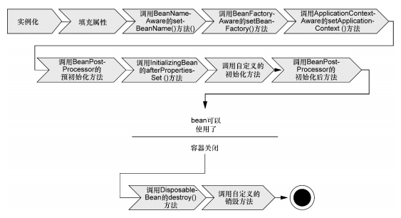

## Spring优点

- 基于POJO的轻量级和最小侵入式编程：不会因为Spring的API弄乱应用代码
- 通过依赖注入和面向接口实现松耦合
- 通过AOP实现声明式编程和减少样板式代码

## SpringIOC

- 将创建对象的控制权交给IOC容器，是依赖倒置原则（依赖接口而非实现）的一种思路，采用的方式为依赖注入

- 依赖注入是将底层类作为参数传入上层类，实现上层控制下层，注入方式有setter、接口、构造器

- IOC容器用于初始化，屏蔽实例细节（封装），初始化过程如下：


## 依赖注入方式

- 构造方法注入
- setter注入
- 接口注入：强制被注入对象实现不必要的接口，带有侵入性，不提倡

## Spring事务传播行为

当事务方法被另一个事务方法调用时，必须通过Propagation指定使用原来的事务还是开启新的事务

- **REQUIRED**（默认值）：在当前事务运行，没有则开启一个事务。
- **REQUIRES_NEW**：在新开启的事务中运行，把当前事务挂起。
- SUPPORTS：在当前事务运行，否则以非事务方式执行。
- MANDATORY（强制）：当前没有事务，就抛出异常。
- NOT_SUPPORTED：以非事务方式执行，存在事务就把事务挂起。
- NEVER：以非事务方式执行，如果当前存在事务，则抛出异常。

## Spring事务隔离级别

通过Isolation指定，包括四种隔离级别和DEFAULT（数据库默认隔离级别），Oracle只支持已提交读和串行化

## Spring乱码问题

- post请求：web.xml配置过滤器，参数可查看源码`CharactorEncodingFilter`
- get请求：tomcat的server.xml中Connector添加参数URIEncoding="utf-8"（tomcat8默认已解决）

## SpringMVC工作流程


- 客户端（浏览器）发送请求，直接请求到 DispatcherServlet。
- DispatcherServlet 根据请求信息调用 HandlerMapping，解析请求对应的 Handler。
- 解析到对应的 Handler（也就是我们平常说的 Controller 控制器）后，开始由 HandlerAdapter 适配器处理。
- HandlerAdapter 会根据 Handler 来调用真正的处理器（Controller里的具体方法）处理请求，并处理相应的业务逻辑。
- 处理器处理完业务后，会返回一个 ModelAndView 对象，Model 是返回的数据对象，View 是个逻辑上的 View。
- ViewResolver 会根据逻辑 View 查找实际的 View。
- DispaterServlet 把返回的 Model 传给 View（视图渲染）。
- 把 View 返回给请求者（浏览器）

## SpringBean作用域

- singleton : 唯一 bean 实例，Spring 中的 bean 默认都是单例的。

  >  IOC实例化时就创建，可通过给bean设置@lazy来延迟初始化，获取bean时才创建，容器关闭时调用destory方法

- prototype（原型） : 每次请求都会创建一个新的 bean 实例。

  > 获取Bean时才会创建，容器关闭也不会调用destory方法

- request : 每一次HTTP请求都会产生一个新的bean，该bean仅在当前HTTP request内有效。

- session : 每一次HTTP请求都会产生一个新的 bean，该bean仅在当前 HTTP session 内有效。


## Spring容器类型

- BeanFactory：基础类型IOC容器，默认采用延迟初始化策略
- ApplicationContext：基于BeanFactory构建的高级（如事件发布、国际化信息支持等）IOC容器，默认完成bean的初始化
  - AnnotationConfigApplicationContext：基于Java配置类中加载Spring应用上下文
  - AnnotationConfigWebApplicationContext：基于Java配置类中加载Spring Web应用上下文
  - ClassPathXmlApplicationContext：从类路径下的XML文件中加载上下文定义
  - FileSystemXmlApplicationContext：从文件系统（如C盘）的XML文件中加载上下文定义
  - XmlWebApplicationContext：从Web应用下的XML文件中加载上下文定义

## SpringBean生命周期



1. 读取xml配置文件或者注解获取bean的定义，通过反射创建对象

2. 设置对象属性

3. 如果实现了*Aware相关接口则通过set方法设置相关依赖

   > 如BeanNameAware传入bean的名字、BeanClassLoaderAware传入ClassLoader对象实例、BeanFactoryAware传入BeanFactory、ApplicationContextAware传入ApplicationContext等

4. 如果实现了BeanPostProcessor，则调用postProcessBeforeInitialization方法

5. 调用初始化方法

   - 如果bean实现了InitializingBean接口，则执行afterPropertiesSet方法
   - 如果通过xml或者注解添加了init方法，则执行

6. 如果实现了BeanPostProcessor，则调用postProcessAfterInitialization方法

7. 使用

8. 调用销毁方法

   - 如果实现了DisposableBean接口，则调用destroy方法
   - 如果通过xml或者注解添加了destroy方法，则执行

## SpringBean单例与线程安全

Spring的默认单例bean是线程不安全的，可通过两种方式解决：

- ThreadLocal
- 同步锁

## 自动装配策略

- no（默认）：无需自动装配，除非bean上配置了Autowire属性
- byName：通过属性的名称与bean的id匹配

```java
public class User{
	private Role myRole;
}
public class Role {
	private String id;	
	private String name;
}
<bean id="myRole" class="com.viewscenes.netsupervisor.entity.Role">
	<property name="id" value="1001"></property>
	<property name="name" value="管理员"></property>
</bean>

<bean id="user" class="com.viewscenes.netsupervisor.entity.User" autowire="byName"></bean>
```

- byType：通过bean的class属性装配

```java
<bean class="com.viewscenes.netsupervisor.entity.Role">
	<property name="id" value="1001"></property>
	<property name="name" value="管理员"></property>
</bean>

<bean id="user" class="com.viewscenes.netsupervisor.entity.User" autowire="byType"></bean>
```

- byConstructor：把与bean的构造器入参具有**相同类型**的其他bean装配到bean构造器中

```java
public class User{
	private Role role;

	public User(Role role) {
		this.role = role;
	}
}

<bean id="user" class="com.viewscenes.netsupervisor.entity.User" autowire="constructor"></bean>
```

**@Autowired**

- 强制性，默认一定要将属性赋值好，没有就报错，可通过添加required=flase设置为非强制性

- 装配策略：默认使用byType装配，如果匹配到类型的多个实例（如同一接口的不同实现），再通过byName来确定bean
- @Qualifier("bookDao")：使用该注解来指定需要装配的组件的id，而不是使用属性名
- @Primary：装配时默认使用首选的bean，也可以同时使用@Qualifier

另外Spring还支持两个Java规范的注解

- @Resource（JSR250）：默认按名称装配，不支持@Primary和required=false
- @Inject（JSR330）：需导入依赖，默认有@Primary功能，不支持required=false功能

## SpringAOP

- 将与业务无关却为模块共同调用的代码（事务、日志、权限）封装起来，减少重复代码，解耦，易于拓展维护

- Spring aop基于动态代理实现，被代理类实现了接口，则通过JDK proxy代理，否则通过Cglib代理（生成被代理对象的子类作为代理）

  > JDK动态代理生成的代理类为Proxy的子类，由于Java类的单继承，故只能通过接口实现代理

- Spring aop运行时增强（动态生成字节码），Aspectj编译时增强（操作字节码）


## Spring的设计模式

- 代理模式
  - JDK代理是通过实现InvocationHandler接口的invoke方法，代理的是接口，所有目标类必须要实现接口，通过Proxy.newProxyInstance得到代理对象，Spring默认使用
  - JDK无法代理时使用CGLIB代理，CGLIB代理时通过动态字节码增强技术，派生出目标类的子类，执行时调用生成的子类，目标类或其方法被final修饰将无法代理
- 单例模式
- 工厂模式
- 模板方法模式：RestTemplate、AmqpTemplate、JpaTemplate

